# Effective Guidance for Model Attention with Simple Yes-no Annotations

## Installation
You can download all required packages by using the following command.
```
conda env create -f environment.yml
```

## Dataset
You can download each dataset by clicking the dataset name.
* [Waterbirds](https://nlp.stanford.edu/data/dro/waterbird_complete95_forest2water2.tar.gz)
* [Biased CelebA](http://mmlab.ie.cuhk.edu.hk/projects/CelebA.html)
* [Backgrounds Challenge](https://github.com/MadryLab/backgrounds_challenge)

## Pretrained Models
You can download the pretrained models that attend to irrelevant areas at [this link](https://drive.google.com/drive/folders/1VgLRPWDXpd8JZeDlA2NNVQNAU5vbuKt_?usp=share_link). Please download and place the models under the folder `model`.

## Saliency Maps for Pretrained Models
You can download the files for the saliency maps for the pretrained models at [this link](https://drive.google.com/drive/folders/18zsVWF3kdX7uu40kS5RU3kMDwW_YKvc0?usp=share_link). Please download and place them under the folder `interpretation`.

## File structure
We suggest you to save data, models, and interpretation results following the file structure below.

    .
    ├─ data
    │   ├─ waterbirds
    │   │   ├─ images: contains 200 folders; each folder for each bird species
    │   │   └─ metadata.csv
    │   ├─ biased_celeba
    │   │   ├─ celeba
    │   │   │   └─ img_align_celeba: this folder contains images
    │   │   ├─ list_attr_celeba.txt
    │   │   ├─ biased_celeba_black_hair_1_100_train.csv
    │   │   └─ biased_celeba_black_hair_test.csv
    │   └─ background
    │   │   ├─ original
    │   │   │   ├─ train: contains 9 folders; each folder for each class
    │   │   │   └─ val: contains 9 folders; each folder for each class
    │   │   ├─ mixed_same
    │   │   │   └─ val: contains 9 folders; each folder for each class
    │   │   ├─ mixed_rand
    │   │   │   └─ val: contains 9 folders; each folder for each class
    │   │   └─ only_fg
    │   │   │   └─ val: contains 9 folders; each folder for each class
    ├─ model
    │   ├─ waterbirds_resnet50.pth
    │   ├─ biased_celeba_resnet50.pth
    │   └─ background_resnet50.pt
    ├─ interpretation
    │   ├─ waterbirds_gradcam.json
    │   ├─ biased_celeba_gradcam.json
    │   └─ background_gradcam.json
    ├─ annotation
    ├─ performance
    ├─ script
    ├─ src
    └─ README.md

## Running CRAYON
On the command line, type as following:
```
cd script/DATA_NAME
sh METHOD_NAME.sh
```
For example, if you want to run CRAYON-Attention for the Waterbirds dataset, you can run the code below:
```
cd script/waterbirds
sh crayon_att.sh
```

## Evaluation
CRAYON achieves state-of-the-art performance, outperforming 12 methods across 3 benchmark datasets, surpassing approaches that require more complex annotations.
You can see more details about the training configurations of CRAYON and compared methods at [this link](./misc/training_config.md).

### Waterbirds
| Method | Annotation | WGA | MGA |
|--------|------------|-----|-----|
|Original (Unrefined)|-|28.35|72.08|
|CRAYON-Attention (ours)|Yes-No|72.31|85.23|
|CRAYON-Pruning (ours)|Yes-No|68.97|83.13|
|CRAYON-Pruning+Attention (ours)|Yes-No|**76.04**|**86.03**|
|JtT|-|46.88|78.29|
|MaskTune|-|45.67|79.13|
|LfF|-|44.64|77.24|
|SoftCon|-|46.10|79.93|
|FLAC|-|40.68|80.77|
|LC|-|61.65|80.43|
|CnC|-|46.98|77.80|
|RRR|Map|53.96|82.29|
|GradMask|Map|58.38|82.78|
|ActDiff|Map|64.58|84.54|
|GradIA|Yes-No, Map|60.87|83.17|
|Bounding Box|Bounding Box|66.36|85.85|

### Biased CelebA
| Method | Annotation | WGA | MGA |
|--------|------------|-----|-----|
|Original (Unrefined)|-|32.60|73.71|
|CRAYON-Attention (ours)|Yes-No|83.29|89.61|
|CRAYON-Pruning (ours)|Yes-No|69.51|86.75|
|CRAYON-Pruning+Attention (ours)|Yes-No|**84.38**|**90.13**|
|JtT|-|35.25|74.29|
|MaskTune|-|37.72|78.85|
|LfF|-|44.35|77.05|
|SoftCon|-|42.38|76.16|
|FLAC|-|39.31|76.73|
|LC|-|64.98|84.80|
|CnC|-|37.76|75.34|
|RRR|Map|42.16|78.64|
|GradMask|Map|8.43|65.72|
|ActDiff|Map|41.29|79.08|
|GradIA|Yes-No, Map|41.80|76.58|
|Bounding Box|Bounding Box|33.34|73.03|

### Backgrounds Challenge
We note that lower BG-Gap means better performance.

| Method | Annotation | MR | BG-Gap |
|--------|------------|-----|-----|
|Original (Unrefined)|-|78.27|12.99|
|CRAYON-Attention (ours)|Yes-No|80.85|8.52|
|CRAYON-Pruning (ours)|Yes-No|78.61|12.18|
|CRAYON-Pruning+Attention (ours)|Yes-No|**81.66**|**8.40**|
|JtT|-|77.61|12.99|
|MaskTune|-|78.14|12.54|
|LfF|-|78.23|12.41|
|SoftCon|-|73.14|11.58|
|FLAC|-|79.91|9.75|
|LC|-|74.78|13.35|
|CnC|-|77.87|12.91|
|RRR|Map|80.08|10.68|
|GradMask|Map|80.11|10.63|
|ActDiff|Map|75.84|11.73|
|GradIA|Yes-No, Map|79.79|11.26|
|Bounding Box|Bounding Box|80.82|9.81|

## Varying Number of Annotations
We evaluate how the number of annotations affects CRAYON's performance.

<table>
  <tr>
    <td>Waterbirds</td>
    <td>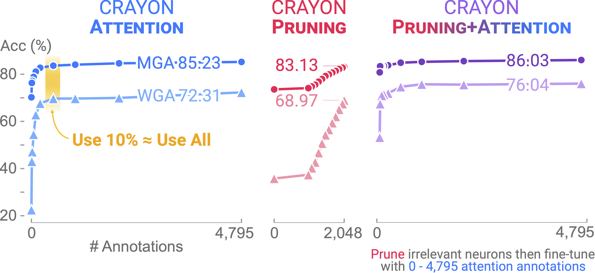</td>
  </tr>
  <tr>
    <td>Biased CelebA</td>
    <td>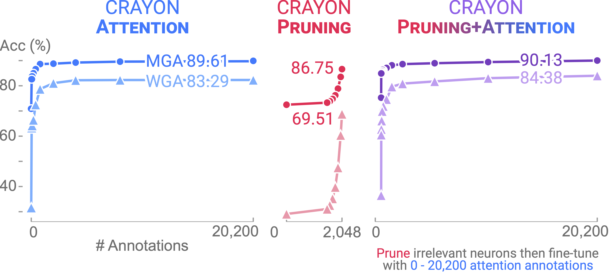</td>
  </tr>
  <tr>
    <td>Backgrounds Challenge</td>
    <td>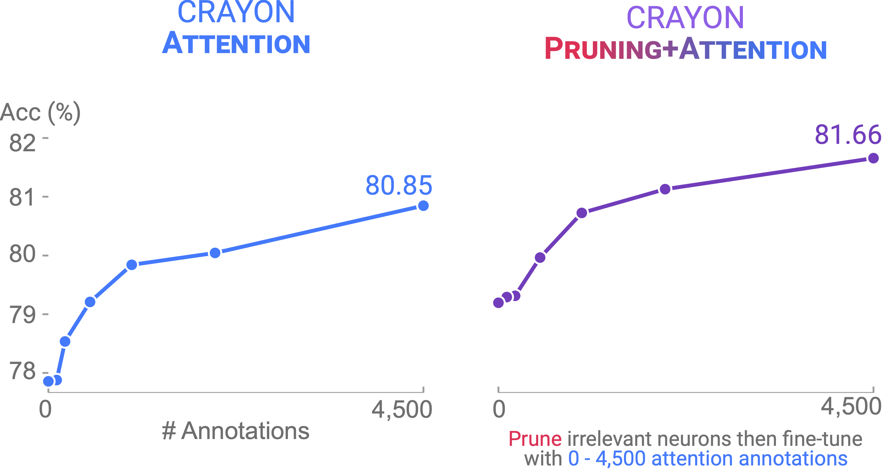
    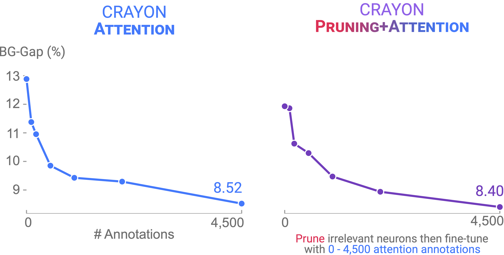</td>
  </tr>
</table>

## Hyperparameter Sensitivity
We examine how the two hyperparameters, $\alpha$ and $\beta$, affect the performance of CRAYON-Attention. While it shows effectiveness across various values of $\alpha$ and $\beta$, careful tuning can achieve much higher performance.

<table>
  <tr>
    <td>Waterbirds</td>
    <td>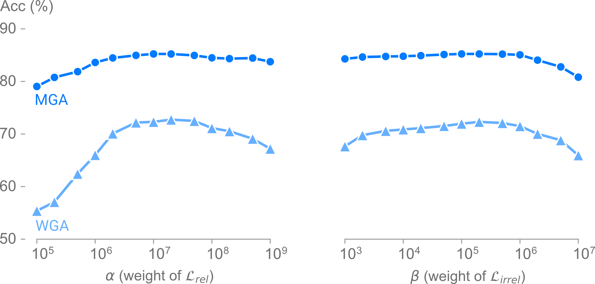</td>
  </tr>
  <tr>
    <td>Biased CelebA</td>
    <td>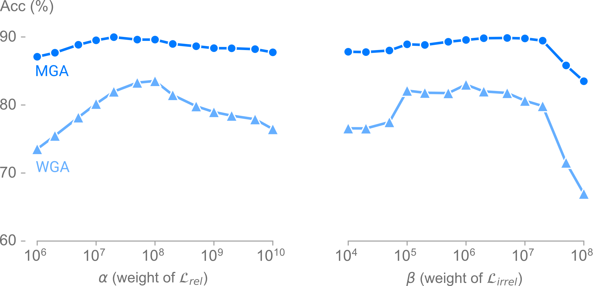</td>
  </tr>
  <tr>
    <td>Backgrounds Challenge</td>
    <td>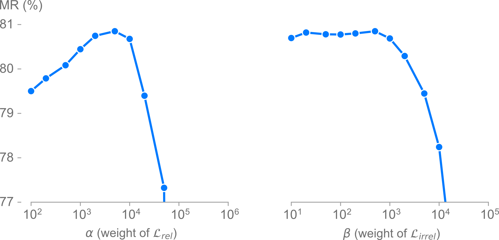
    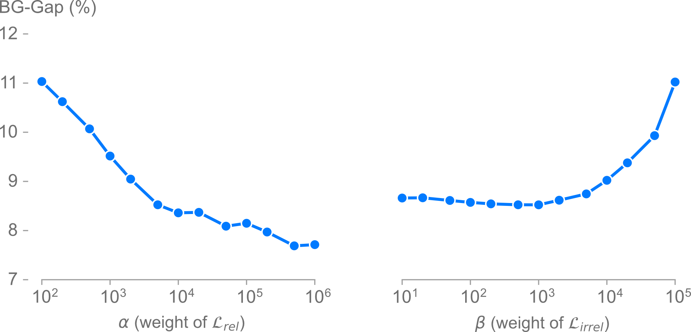</td>
  </tr>
</table>

Likewise, we also examine the effect on CRAYON-Pruning+Attention.

<table>
  <tr>
    <td>Waterbirds</td>
    <td>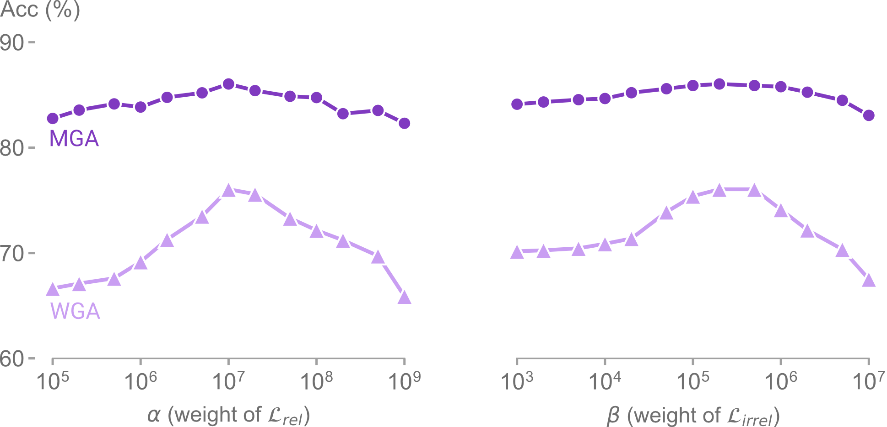</td>
  </tr>
  <tr>
    <td>Biased CelebA</td>
    <td>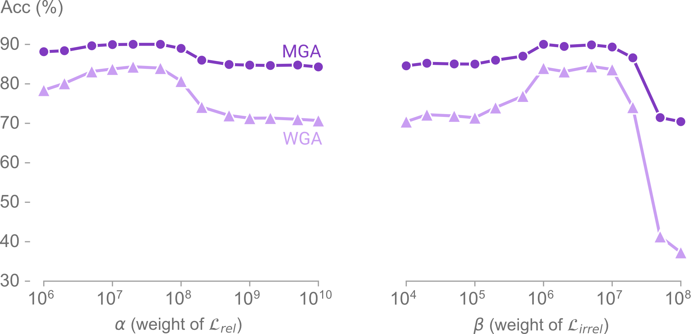</td>
  </tr>
  <tr>
    <td>Backgrounds Challenge</td>
    <td>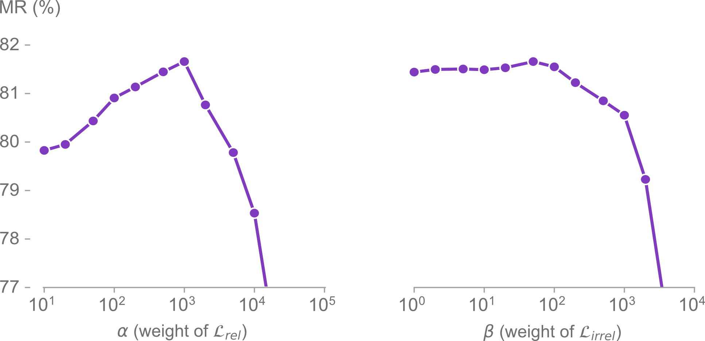
    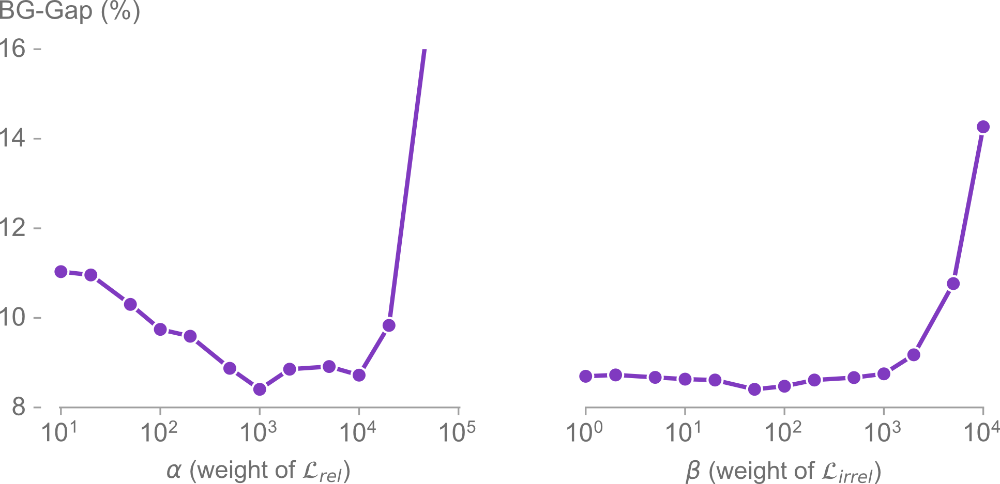</td>
  </tr>
</table>
